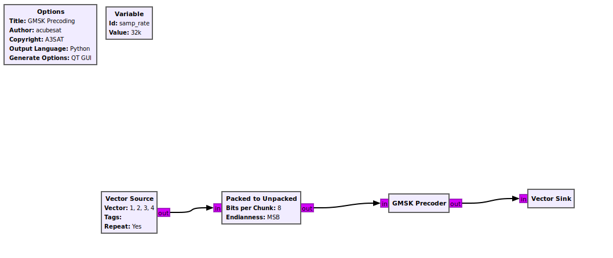

### GMSK Precoder

Since GMSK also operates by change in phase (π/2 for a transmitted 1 and -π/2 for a transmitted 0). By 
adding a differential precoder to the transmitter, we can interpret received GMSK symbols as OQPSK ones,
without the need for implementing a differential encoder on the receiver, which would approximately double the BER.

In GMSK, transmitting a `1` preserves the value of the I branch to the Q branch (`I:1, Q:1` or `I:0, Q:0`) while a `0` 
inverts it.
Thus, the equivalent OQPSK symbol will be:

```math
1 + b_k + b_{k-1}
```

where `b` are the transmitted bits.

When going from Q to I, the exact opposite behavior happens (meaning that `0` preserves the value while `1`
inverts it) so similarly, the equivalent OQPSK symbol will be:

```math
b_k + b_{k-1}
```

A very detailed and clear write-up can be found in [this post](https://destevez.net/2018/06/dslwp-b-gmsk-detector/) 
by Dr. Daniel Estévez.


### Flowgraph

The flowgraph itself, just unpacks the bits from a random byte source, feeds them to the precoder and simply captures 
the result in a vector sink.



