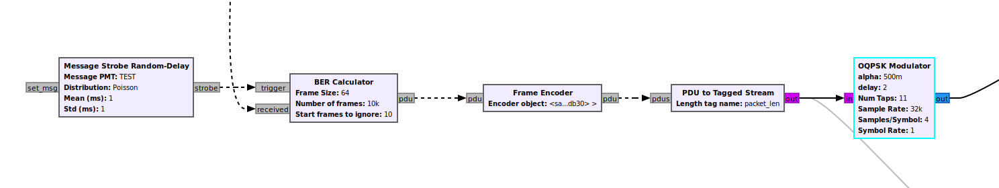

### OQPSK Modulation and Demodulation
---
The following flowgraph simulates the operation of the OQPSK modulation/demodulation system and tests its reliability.
It accomplishes this by transmitting a number of messages, passing them through a channel model, then receiving them 
and calculating the Bit Error Rate (BER).

#### Running the flowgraph

When you first try to run the flowgraph you need to open OQPSKhier.grc and press `f5` (Generate the flowgraph).
Then the OQPSK1.grc is ready to be executed.

#### Transmission

First, the said messages are encoded as a frame, which is then converted to a tagged stream of bytes and passed through
the OQPSK modulator

The OQPSK Modulator hier block takes chunks of 2 bits and passes them through a differential encoder to then create a complex symbol,
whose real and imaginary components are fed to a Root Raised Cosine filter.

After the modulation, the data are passed through a channel model where noise is added.

#### Reception

When the noisy input at the demodulator's reception arrives, the Polyphase Clock Sync Blocks first
determine the optimal timing for the sampling (Clock Recovery). Then the Equaliser inverts the
effects of the channel and makes the signal clearer. The Costas Loop is added for frequency correction
which makes the constellation at its output become evident.

Note that the half symbol delay added to the real component is the offset in OQPSK

After the constellation data are decoded , differentially as well, are fed to the Frame Decoder.
Finally, the received message is compared to the trasmitted one and the BER is calculated through
a number of repetitions of this cycle

