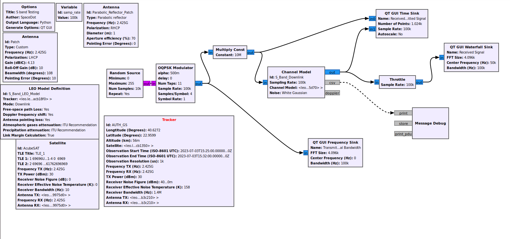

### S Band Transmission
---
The follwing flowgraph simply tests the efficiency of the OQPSK Modulator in the S-Band, using the gr-leo Model Definitions

More specifically a random input is passed through the modulator, then amplified (Multiply Const.)
and fed to the channel model. Afterwards it is captured at a waterfall sink and can be compared
with the signal before the channel.

The channel model uses parameters from the antennae and the satellite models to simulate the
actual operational conditions to a certain extent.

#### Flowgraph

