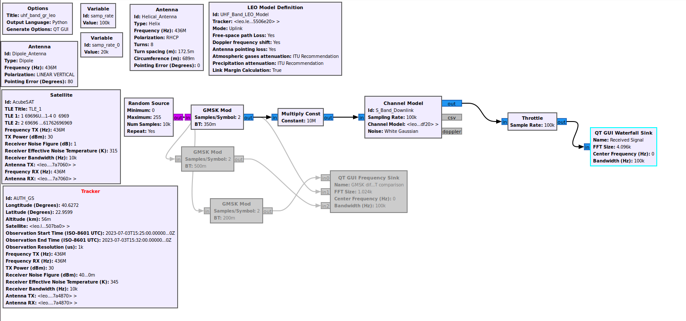
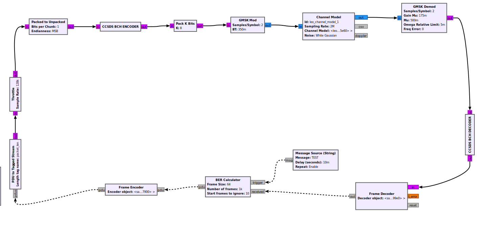

### UHF Band Transmission and Reception
---
#### Transmission

The first flowgraph (uhf\_band\_gr_leo.grc) tests the efficiency of the GMSK Modulator in the 
UHF-Band, using the gr-leo Model Definitions, similarly to the S-band flowgraph

More specifically a random input is passed through the modulator, then amplified (Multiply Const.)
and fed to the channel model. Afterwards it is captured at a waterfall sink.

The channel model uses parameters from the antennae and the satellite models to simulate the
actual operational conditions to a certain extent.

##### Flowgraph

#### Reception and BER Calculation

The second flowgraph (uhf\_band\_gr_leo-decode.grc) simulates the operation of the GMSK modulation/
demodulation system along with BCH encoding for error correction and tests its reliability.
It accomplishes this by transmitting a number of messages, passing them through a channel model, 
then receiving them and calculating the Bit Error Rate (BER).

The messages encoded as frames, which are then converted to a tagged stream of bytes, are encoded
with BCH and then GMSK modulated. After undergoing the effects of the channel model (which is made
as good an estimate as possible using antennae and satellite parameters), the signal is demodulated
and BCH decoded. Finally after the frame is decoded the received message is compared with the
transmitted one and the BER is calculated

##### Flowgraph

