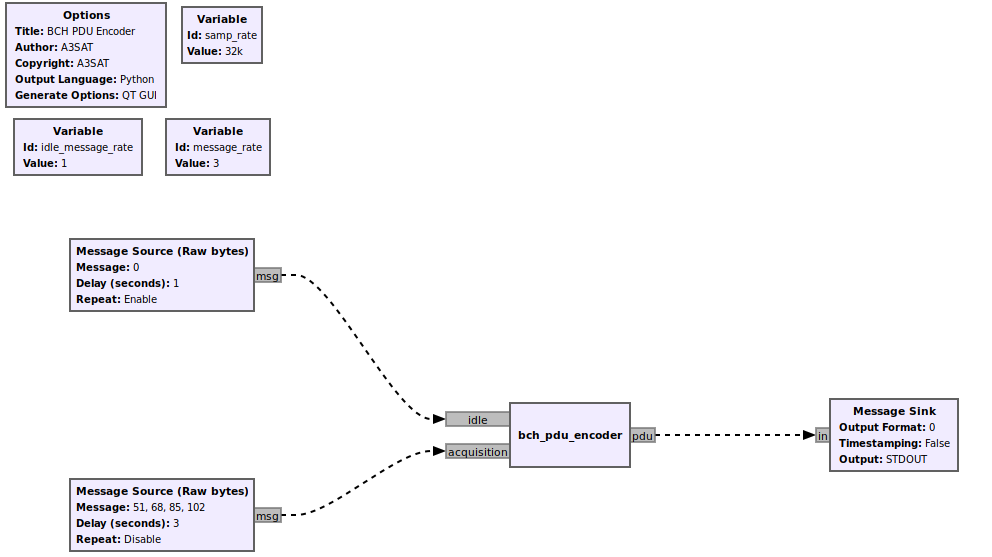

# BCH PDU Encoder

Simple flowgraph for testing the BCH Encoder as described in [CCSDS 231.0-B-4](https://public.ccsds.org/Pubs/231x0b4e0.pdf)

The BCH encoder accepts a [PMT](https://wiki.gnuradio.org/index.php/Polymorphic_Types_(PMTs)) in the `acquisition` port containing uncoded data, segments them into 56bit words and concatenates the resulting 64bit codewords together to form the encoded data. The block is also responsible for adding a header and trailer sequence to construct a valid CLTU as per the standard.

Additionally, the block also supports generation of an idle sequence for the purposes of synchronization. This serves as an alternative option to idle packages transmitted from the satellite at the expense of a possible added delay. This is accomplished by sending a message to the `idle` port. The actual contents of the message don't matter as a predefined sequence will be transmitted each time to ensure sufficient randomization.

